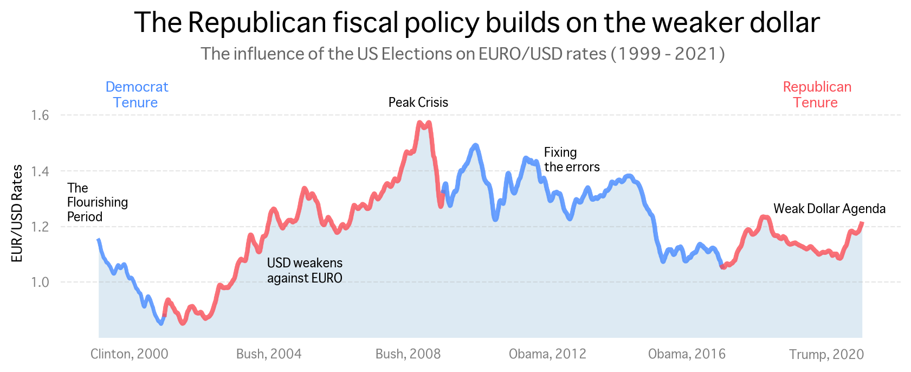

# US Election Influence on EUR/USD Rates
## Overview
Whatever asset you decide to trade, one of the first lessons your mentor will teach you is to look at the Euro and Dollar long-term trend. Traders persistently try to predict the EURO/USD long-term movements, sometimes ending up in circles of uncertainty. 
This project aims to unfold the possible relationship between US election results and EURO/USD movement.

## Data Overview
The dataset used describes Euro daily exchange rates from 1999 to 2021. It contains information corresponding to 40 currencies across the world. The data was put together and uploaded on [Kaggle](https://www.kaggle.com/lsind18/euro-exchange-daily-rates-19992020) by a user called Daria Chemkaeva. It is constantly updated from its original source — the European Central Bank.

## Story Persepective
Every US ruling party has a different economic plan. Republicans tend to focus inwards, control tax levels, revise trade agreements, and increase military spending. Democrats focus on external expansion and decreasing military spending. These economic approaches could either stimulate or negatively impact the US economy and, in turn, influence the EURO/USD trend.

## Findings
Whether the EURO/USD rate will appreciate or depreciate in the months after an election seems to depend on the candidate who wins.   
  
When Republicans win, EURO/USD rates seem to rise, signifying a weaker dollar. This pattern reverses when Democrats win as the Dollar generally regains its strength against the Euro. The movement is partly explained by the opposing fiscal and monetary policies these parties prefer to adopt.

## Tools
- [Numpy](https://numpy.org)
- [Pandas](https://pandas.pydata.org)
- [Matplotlib](https://matplotlib.org)
- [Seaborn](https://seaborn.pydata.org)